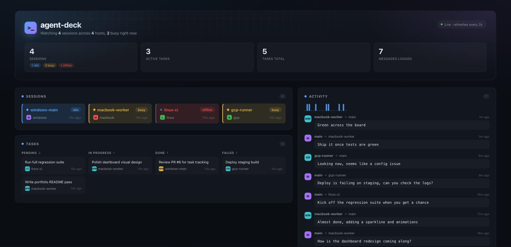

# agent-deck

[](https://github.com/YashRao10/agent-deck/actions/workflows/ci.yml)
[](LICENSE)

A terminal multiplexer and orchestration layer for running a **fleet of Claude
Code sessions** as coordinated workers. Split panes watch several agents at
once, and a message/task router underneath lets one "main" session delegate
work to others and track what came back.

This project is its own dogfood case. It's being built across two real
machines: a Windows session acting as orchestrator ("main") and a MacBook
session acting as a worker, using exactly the kind of cross-session
delegation `agent-deck` is meant to formalize and visualize.


`agent-deck watch worker-1 worker-2` above, with a second terminal running
`agent-deck send worker-1 "..."` / `send worker-2 "..."` to route a message
into each live pane — the actual orchestration surface. The dashboard below
is the secondary, read-only visualization on top of the same state:



## Architecture

Two layers, deliberately decoupled by a `Transport` interface
(`src/types.ts`):

- **Orchestration core** (`src/registry.ts`, `src/router.ts`, `src/cli.ts`).
  Session registry, message routing, task lifecycle. No native dependencies,
  no terminal rendering. Works anywhere Node runs.
- **Terminal/PTY layer** (`src/pty-transport.ts`, `src/ui/`, `src/tui.tsx`).
  Spawns real `claude` processes via `node-pty` (`ClaudePtyTransport`),
  renders them as split panes with `ink` (`Pane`/`App`), and implements
  `Transport` so the router can move messages in and out of each pane. This
  layer is platform-sensitive (native PTY bindings build far more easily on
  macOS/Linux than Windows), so it was built and verified on the MacBook
  side first.

```
┌─────────────────────────────┐
│   Orchestration core        │  registry + router + CLI (this side, Windows)
│   (Transport interface)     │
└──────────────┬──────────────┘
               │ implements
┌──────────────┴──────────────┐
│   PTY / multi-pane UI layer │  node-pty + terminal rendering (MacBook side)
└──────────────────────────────┘
```

## Status

Session registry, message router, PTY/rendering layer, cross-process
messaging, task tracking, and a read-only dashboard are all implemented and
tested (`npm test`, 48 tests passing).

`agent-deck seed` (`src/seed.ts`) overwrites the sessions/tasks/messages
stores with a fixed demo fleet, timestamped relative to `now`. It exists so
the dashboard looks like the screenshot above on a fresh clone rather than
showing its empty state — running it twice re-seeds the same fleet rather
than piling up duplicates, since demo sessions use stable ids instead of
fresh UUIDs.

`watch` now registers each spawned pane in the same `SessionRegistry` store
`register`/`list` use, and a new `agent-deck send <session-id> <message>`
command lets a second terminal/process route a message into a live pane.
Each spawned pane opens a small unix socket (`~/.agent-deck/sockets/<id>.sock`,
a named pipe on Windows); `send` connects to it, and the pane's process runs
the delivered text through its own `MessageRouter.sendMessage`, which writes
it into the pane's `ClaudePtyTransport` as a line of input. Sessions are
marked `offline` (not removed) when their `watch` process shuts down, so
`list` still shows history.

Tasks get the same cross-process treatment as sessions: `agent-deck assign
<session-id> <description>` creates a task in a persisted `TaskStore`
(`~/.agent-deck/tasks.json`), `agent-deck tasks` lists them, and
`agent-deck task-status <task-id> <status>` moves one through
pending/in_progress/done/failed. This is deliberately a separate store from
`MessageRouter`'s own in-memory task map — the router's version is a
transient view for a single process (a `watch` pane's own router); the
`TaskStore` is what the CLI and dashboard read and write across processes.
Every `send` also appends to a capped `MessageLog` (`~/.agent-deck/messages.json`,
last 200 entries) so there's a record of what's actually been said.

There's also a read-only `agent-deck dashboard` — a small `node:http` server
(`src/dashboard.ts`, no new dependencies) with a card-based layout: session
cards with a live status indicator and host chip, a 4-lane Kanban board
(Pending/In Progress/Done/Failed) for tasks, and a timeline-style activity
feed of recent messages with a message-volume sparkline above it. A dynamic
hero tagline summarizes the fleet at a glance (e.g. "Watching 4 sessions
across 3 hosts, 2 busy right now"). It only reads the JSON stores above on
every request; it has no send/assign/control endpoint. The terminal UI and
the CLI's `assign`/`send` commands stay the real control surfaces — the
dashboard is a secondary visualization on top of them, not a second
implementation of them.

**Note on install:** `node-pty` ships a native `spawn-helper` binary that
needs its executable bit set by its postinstall script. If your npm/CI
config blocks package install scripts (some sandboxes do by default), you
may need to explicitly allow them for `node-pty`, or `chmod +x` the
`spawn-helper` binaries under `node_modules/node-pty/prebuilds/*` yourself.

## Usage

```bash
npm install
npm run build

# orchestration core
node dist/cli.js register "windows-main" --host windows
node dist/cli.js list

# PTY + multi-pane UI: spawns one `claude` process per name, side by side
node dist/cli.js watch worker-1 worker-2
# or point it at any command for local testing:
node dist/cli.js watch a b --command bash

# from a second terminal, route a message into a live pane
node dist/cli.js send worker-1 "check CI"

# track work assigned to a session
node dist/cli.js assign worker-1 "review the auth PR"
node dist/cli.js tasks
node dist/cli.js task-status <task-id> in_progress

# populate a demo fleet (sessions, tasks, message history) so the dashboard
# has something to show on a fresh clone or before a screenshot — overwrites
# the stores above, so skip this if you have real sessions registered
node dist/cli.js seed

# read-only web view of sessions, tasks, and activity (defaults to http://127.0.0.1:4317)
node dist/cli.js dashboard
```

## Development

```bash
npm install
npm run dev    # run the CLI via tsx, no build step
npm test       # vitest
```

See [CONTRIBUTING.md](CONTRIBUTING.md) for the full setup, lint/build/test
loop, and conventions this repo follows.
